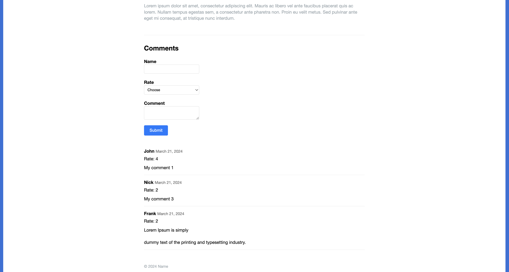

# PHP website

## Overview

- HTML layout and CSS similar to Scriptor Jekyll theme
- PHP Templates
- Load Articles From DB
- Leave comments and ratings on articles without reloading the page using jQuery AJAX
- Calculate the average ratings of articles

## Changelog

[CHANGELOG.md](CHANGELOG.md) generated with [conventional-changelog-cli](https://github.com/conventional-changelog/conventional-changelog/tree/master/packages/conventional-changelog-cli) following the [Conventional Commits](https://www.conventionalcommits.org/en/v1.0.0/) specification

## Project Structure

```
.
├── README.md
├── inc
│   ├── article-comment-form.php
│   ├── article-comment-list.php
│   ├── article.php
│   ├── footer.php
│   ├── functions.php
│   ├── head.php
│   ├── init.php
│   └── site_header.php
└── webroot
    ├── about.php
    ├── article.php
    ├── css
    │   └── styles.css
    ├── images
    │   ├── mountain.jpg
    │   └── road.jpg
    ├── index.php
    └── js
        └── jquery-3.7.1.js
```

- `inc` - contains basic php templates for web site components
  - `functions.php` - contains functions for working with the database
  - `init.php` - contains code for initial initialization of the database
- `webroot` - contains php of main pages in which templates from `inc` are imported

## Showcase


_Home Page_


_About Page_


_Specific Article Page_


_Specific Article Page (continuation)_
